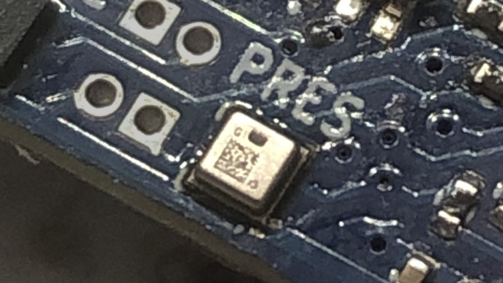

# SPL07-003 Arduino Library
An Arduino library for interfacing with the SPL07-003 pressure & temperature sensor over I2C.

## Introduction
Recently I was looking for an inexpensive pressure + temperature sensor for a barometric altimeter project, which then led to me finding the SPL07-003. After learning there was no existing library to interface with it, I decided to make one myself.

I've written and tested this library on an STM32F103-based board using the STM32duino framework, though it should work fine on almost any platform. If you have any problems please open an [issue on GitHub](https://github.com/Kenneract/SPL07-003-Arduino-Library/issues).

Note: While the library was designed for the **SPL07-003**, with minor modifications to the coefficient parsing code it should work with similar sensors such as the **SPL06-001** or **SPL06-007**. *(The SPL06 series is also similar to the DPS310, in case you're looking for a potentially compatible library).*

## Features
- Set sensor to idle, single, or continuous measurement modes
- Configure measurement rates (1Hz - 200Hz) and oversampling rates (1x - 128x) for both the pressure and temperature sensors
- Read the most recent pressure or temperature readings with a single function call
- Can apply a linear offset to pressure / temperature measurements
- Configure interrupt pin function and polarity
- Query the interrupt register to find what triggered any interrupts
- Can accept a custom TwoWire object for unique I2C setups
- Can accept a custom I2C address and `SENSOR_ID` for use with other compatible sensors

### Current Limitations
- FIFO buffer usage is not available.
- Only works via I2C, **cannot use SPI**.
- Requires the host MCU support the `uint32_t` datatype.
	- *(This shouldn't be an issue in most cases)*

## Usage
Read the [docs.md](docs/docs.md) file for documentation, and find examples in the [examples](examples) directory.

## Installation

#### Through the Arduino Library Manager (pending)
- Navigate to the Arduino Library Manager
- Search for "SPL07-003"
- Install latest version by Kenneract

#### Manual Installation
- Download this repository as a ZIP file
- Navigate to your Arduino library directory
	- On Windows this is often `.../documents/arduino/libraries/`
- Create a folder named "SPL07-003" in your libraries folder
- Extract the files inside the ZIP file into the "SPL07-003" folder